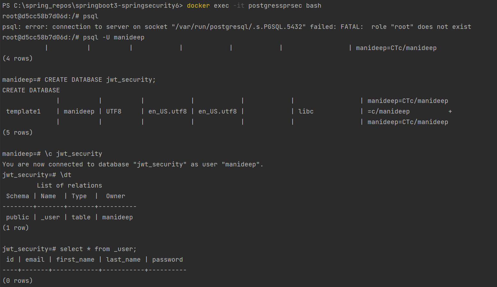

# springboot3-springsecurity6

A springboot 3 app to demonstrate springsecurity 6

Add application.yml and docker-compose.yml

Add User class and related annotations

docker compose up -d -> to create container

docker ps -> to list containers

docker exec -it postgressprsec bash -> allows us to run the shell commands within the postgres container

psql -U manideep -> Connect to user manideep

\l -> will give you list of databases

CREATE DATABASE jwt_security;

Ctrl+ D to come out of shell

\c jwt_security -> will give you shell for jwt_security table

\dt -> list of relations for jwt_security

\d -> list of all relations (including the sequence)

When you run the app, it'll create _user table in db

You'll see the below log in terminal

Hibernate: create sequence _user_seq start with 1 increment by 50
Hibernate:

    create table _user (
       id integer not null,
        email varchar(255),
        first_name varchar(255),
        last_name varchar(255),
        password varchar(255),
        primary key (id)
    )

Springboot security has a class called User and an interface UserDetails which will provide us with some default security related methods/variables.

We need these dependencies to play with jwt

        <dependency>
			<groupId>io.jsonwebtoken</groupId>
			<artifactId>jjwt-api</artifactId>
			<version>0.11.5</version>
		</dependency>
		<dependency>
			<groupId>io.jsonwebtoken</groupId>
			<artifactId>jjwt-impl</artifactId>
			<version>0.11.5</version>
		</dependency>

Resources:
        https://www.youtube.com/watch?v=KxqlJblhzfI
        https://github.com/ali-bouali/spring-boot-3-jwt-security